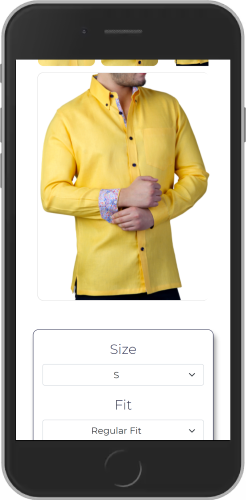
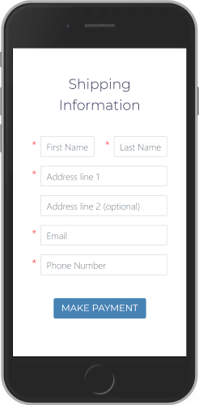
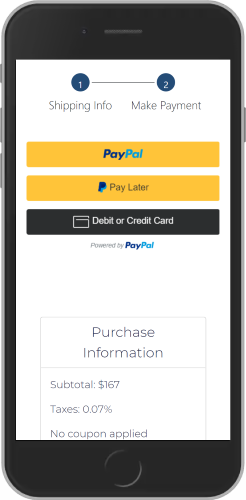
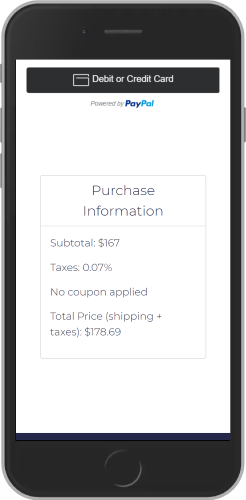
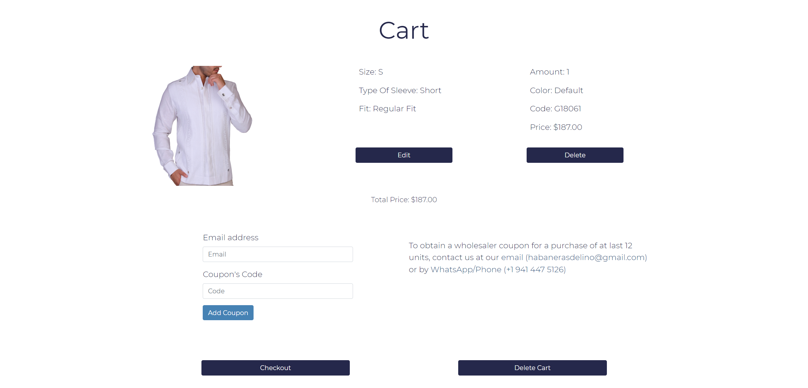
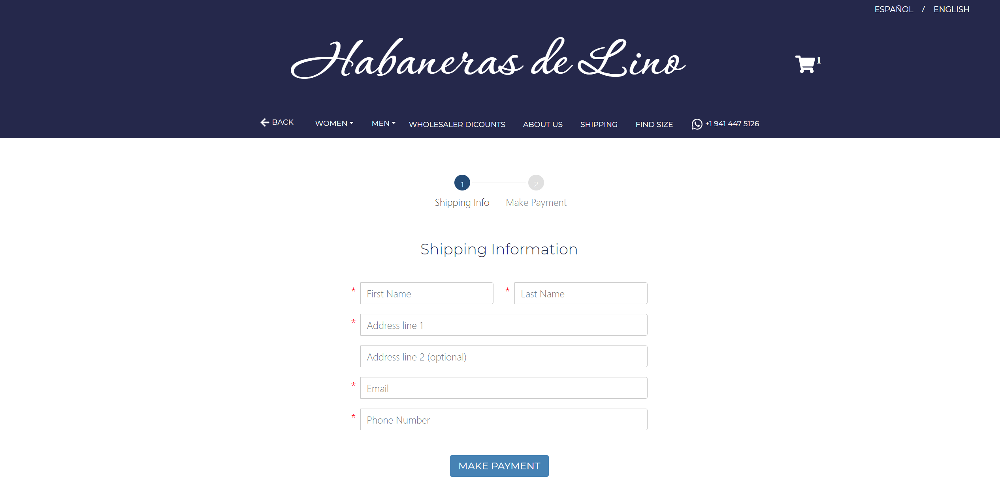
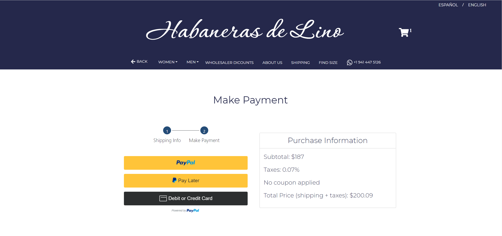
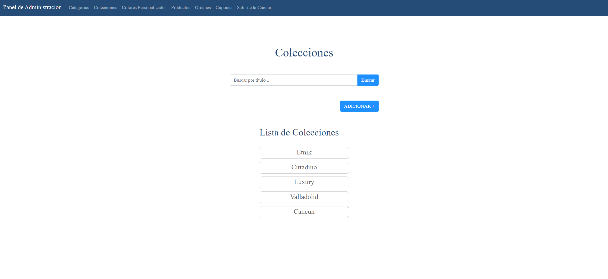
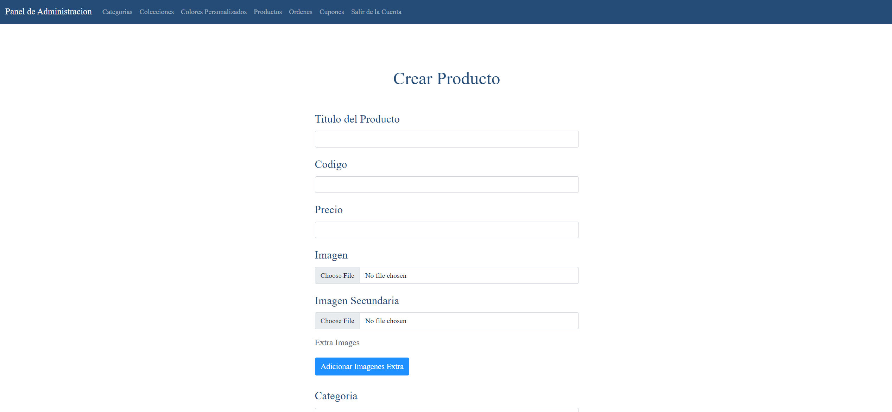
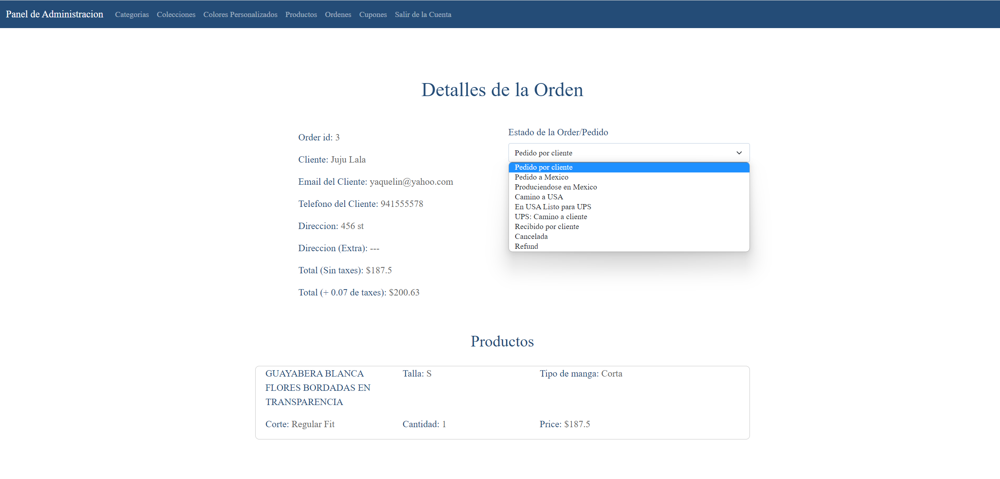

<div align="center">

# Habaneras de Lino 


      

</div>

## Table of Contents
* [Description](#intro)
* [Useful Notes](#useful_notes)
* [Install (Run) with Docker](#docker)
* [Installation without Docker](#installation)
* [Deploy on VPS](#deploy)
* [Screenshots of the Frontend Next js App](#screenshots_frontend)
* [Screenshots of the Django Backend Admin Panel](#screenshots)
* [Useful Links](#useful_links)


<a name="intro"></a>
## Description
__Habaneras de Lino__ is an online store to buy linen and cotton clothes that offers its customers an experience of comfort, luxury ,and modernity. The clients can filter the clothing by category, collection, and other characteristics, as well as customize the product (set color, size, sleeve cut, ...), and save them in their cart as well as apply coupons for discount.

<a name="useful_notes"></a>
## Useful Notes

The backend functionalities can be divided into 2 categories, those that serve the frontend app (NEXT js), and those used for the administration of the store (which is different from the Django Admin). Almost all of the views of the app have been created using CBVs.

### Settings

The __settings__ folder inside the mom_style_api folder contains the different setting's configuration for each environment (so far the environments are development, docker testing, and production). Those files are extensions of the base.py file which contains the basic configuration shared among the different environments (for example, the value of the template directory location). In addition, the .env file inside this folder has the environment variables that are mostly sensitive information and should always be configured before use. By default, the environment in use is the decker testing. To change between environments modify the \_\_init.py\_\_ file.


<a name="docker"></a>
## Install (Run) with Docker

### About the Builds and Images in use:
There are currently 3 services in use: the api (Django App), the db (the postgreSQL database), and the nginx (Nginx configuration).
    - __api:__ The Django Dockerfile is in the root directory, and it has an entrypoint file that connects the backend to the database and runs migrations as well as collects the statics.
    - __db:__ This is built from the postgres:13-alpine image. The default environment variables are set in the docker-compose.yml file.
    - __nginx:__ The default configuration for nginx is inside the nginx folder in the nginx.conf file.

### Runing Docker-Compose

1. Clone the repo:
    ```bash
    git clone https://github.com/Ceci-Aguilera/habaneras_de_lino_api.git
    ```
1. Configure the environment variables.
    1. Copy the content of the example env file that is inside the mom_style_api folder into a .env file:
        ```bash
        cd mom_style_api/settings
        cp simple_env_conf.env .env
        ```
    1. The new .env file should contain all the environment variables necessary to run all the django app in all the environments. However, the only needed variables for docker to run are the following:
        ```bash
        DOCKER_SECRET_KEY
        DOCKER_DB_NAME
        DOCKER_DB_USER
        DOCKER_DB_PASSWORD
        DOCKER_DB_HOST
        DOCKER_DB_PORT
        DOCKER_STRIPE_PUBLISHABLE_KEY
        DOCKER_STRIPE_SECRET_KEY
        ```
    1. For the database, the default configurations should be:
        ```bash
        DOCKER_DB_NAME=docker_habanerasdelino_db
        DOCKER_DB_USER=docker_habanerasdelino_user
        DOCKER_DB_PASSWORD=docker_habanerasdelinouser!
        DOCKER_DB_HOST=db
        DOCKER_DB_PORT=5432
        ```
    1. The DOCKER_SECRET_KEY is the django secret key. To generate a new one see: [Stackoverflow Link](https://stackoverflow.com/questions/41298963/is-there-a-function-for-generating-settings-secret-key-in-django)

    1. The DOCKER_STRIPE_PUBLISHABLE_KEY and the DOCKER_STRIPE_SECRET_KEY can be obtained from a developer account in [Stripe](https://stripe.com/). 
        - To retrieve the keys from a Stripe developer account follow the next instructions:
            1. Log in into your Stripe developer account (stripe.com) or create a new one (stripe.com > Sign Up). This should redirect to the account's Dashboard.
            1. Go to Developer > API Keys, and copy both the Publishable Key and the Secret Key.

    1. The DOCKER_EMAIL_HOST_USER and the DOCKER_EMAIL_HOST_PASSWORD are the credentials to send emails from the website when a client makes a purchase. This is currently disable, but the code to activate this can be found in views.py in the create order view as comments. Therefore, any valid email and password will work.

1. Run docker-compose:
    ```bash
    docker-compose up --build
    ```
1. Congratulations =) !!! The App should be running in [localhost:80](http://localhost:80)
1. (Optional step) To create a super user run:
    ```bash
    docker-compose run api ./manage.py createsuperuser
    ```


<a name="installation"></a>
## Installation without Docker

1. Clone the repo:
    ```bash
    git clone https://github.com/Ceci-Aguilera/habaneras_de_lino_api.git
    ```
1. Configure a virtual env and set up the database. See [Link for configuring Virtual Environment](https://docs.python-guide.org/dev/virtualenvs/) and [Link for Database setup](https://www.digitalocean.com/community/tutorials/how-to-set-up-django-with-postgres-nginx-and-gunicorn-on-ubuntu-16-04).
1. Configure the environment variables.
    1. Copy the content of the example env file that is inside the mom_style_api folder into a .env file:
        ```bash
        cd mom_style_api/settings
        cp simple_env_conf.env .env
        ```
    1. The new .env file should contain all the environment variables necessary to run all the django app in all the environments. However, the only needed variables for the development environment to run are the following:
        ```bash
        SECRET_KEY
        DB_NAME
        DB_USER
        DB_PASSWORD
        DB_HOST
        DB_PORT
        STRIPE_PUBLISHABLE_KEY
        STRIPE_SECRET_KEY
        ```
    1. For the database, the default configurations should be:
        ```bash
        DB_NAME=habanerasdelino_db
        DB_USER=habanerasdelino_user
        DB_PASSWORD=habanerasdelinouser!
        DB_HOST=localhost
        DB_PORT=5432
        ```
    1. The SECRET_KEY is the django secret key. To generate a new one see: [Stackoverflow Link](https://stackoverflow.com/questions/41298963/is-there-a-function-for-generating-settings-secret-key-in-django)

    1. The STRIPE_PUBLISHABLE_KEY and the STRIPE_SECRET_KEY can be obtained from a developer account in [Stripe](https://stripe.com/). 
        - To retrieve the keys from a Stripe developer account follow the next instructions:
            1. Log in into your Stripe developer account (stripe.com) or create a new one (stripe.com > Sign Up). This should redirect to the account's Dashboard.
            1. Go to Developer > API Keys, and copy both the Publishable Key and the Secret Key.

    1. The EMAIL_HOST_USER and the EMAIL_HOST_PASSWORD are the credentials to send emails from the website when a client makes a purchase. This is currently disable, but the code to activate this can be found in views.py in the create order view as comments. Therefore, any valid email and password will work.

1. Run the migrations and then the app:
    ```bash
    python manage.py migrate
    python manage.py runserver
    ```
1. Congratulations =) !!! The App should be running in [localhost:8000](http://localhost:8000)
1. (Optional step) To create a super user run:
    ```bash
    python manage.py createsuperuser


<a name="deploy"></a>
## Deploy on VPS

1. Clone the repo:
    ```bash
    git clone https://github.com/Ceci-Aguilera/habaneras_de_lino_api.git
    ```
1. Install the dependencies:
    ```bash
    sudo apt-get update
    sudo apt-get install python3-pip python3-dev libpq-dev postgresql postgresql-contrib nginx
    ```
1. Set up the postgresql database [Setup Database](https://www.digitalocean.com/community/tutorials/how-to-set-up-django-with-postgres-nginx-and-gunicorn-on-ubuntu-16-04)
1. Create an .env file and configure the environment variables
1. Create a virtual env and activate it:
    ```bash
    virtualenv myprojectenv
    source myprojectenv/bin/activate
    ```
1. Pip install the requirements:
    ```bash
    pip install -r requirements.txt
    ```
1. Pip install gunicorn:
    ```bash
    pip install gunicorn
    ```
1. Run the migrations and then test the the app:
    ```bash
    python manage.py migrate
    python manage.py runserver
    ```
1. Complete the setup of the website with this [Link](https://www.digitalocean.com/community/tutorials/how-to-set-up-django-with-postgres-nginx-and-gunicorn-on-ubuntu-16-04)
1. Configure the CORS to allow the Frontend to make api calls. See [Link](https://www.stackhawk.com/blog/django-cors-guide/)


<a name="screenshots_frontend"></a>

## Screenshots of the Frontend NEXT JS App

### Mobile View

<div align="center">

  

</div>

<div align="center">

  

</div>

<div align="center">

  

</div>

---
### Desktop View


---


---


---


---



---




---



---


<a name="screenshots"></a>

## Screenshots of the Django Backend Admin Panel




---



---




<a name="useful_links"></a>
## Useful Links

### Postgresql Databse
- Setup Database: [Digital Ocean Link for Django Deployment on VPS](https://www.digitalocean.com/community/tutorials/how-to-set-up-django-with-postgres-nginx-and-gunicorn-on-ubuntu-16-04)

### Docker
- [Docker Oficial Documentation](https://docs.docker.com/)
- Dockerizing Django, PostgreSQL, guinicorn, and Nginx:
    - Github repo of sunilale0: [Link](https://github.com/sunilale0/django-postgresql-gunicorn-nginx-dockerized/blob/master/README.md#nginx)
    - My repo to Dockerize Django + Postgresql + Nginx + React js: [Ceci-Aguilera/django-react-nginx-mysql-docker](https://github.com/Ceci-Aguilera/django-react-nginx-mysql-docker)
    - Michael Herman article on testdriven.io: [Link](https://testdriven.io/blog/dockerizing-django-with-postgres-gunicorn-and-nginx/)

### Django and DRF
- [Django Official Documentation](https://docs.djangoproject.com/en/4.0/)
- Generate a new secret key: [Stackoverflow Link](https://stackoverflow.com/questions/41298963/is-there-a-function-for-generating-settings-secret-key-in-django)
- Modify the Django Admin:
    - Small modifications (add searching, columns, ...): [Link](https://realpython.com/customize-django-admin-python/)
    - Modify Templates and css: [Link from Medium](https://medium.com/@brianmayrose/django-step-9-180d04a4152c)
- [Django Rest Framework Official Documentation](https://www.django-rest-framework.org/)
- More about Nested Serializers: [Stackoverflow Link](https://stackoverflow.com/questions/51182823/django-rest-framework-nested-serializers)
- More about GenericViews: [Testdriver.io Link](https://testdriven.io/blog/drf-views-part-2/)

### Miscellaneous
- Create Virual Environment with Virtualenv and Virtualenvwrapper: [Link](https://docs.python-guide.org/dev/virtualenvs/)
- [Configure CORS](https://www.stackhawk.com/blog/django-cors-guide/)
- [Setup Django with Cloudinary](https://cloudinary.com/documentation/django_integration)